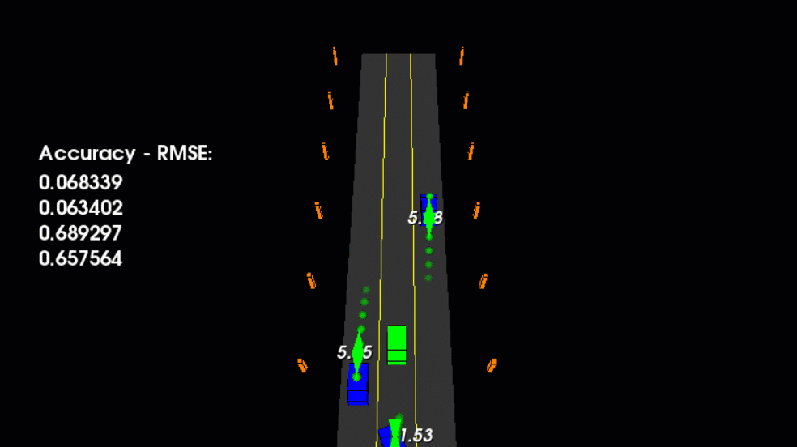

# Unscented Kalman Filter for LiDAR and Radar Fusion

Implementing an Unscented Kalman Filter to estimate the state of multiple cars on a highway using noisy LiDAR and radar measurements, obtaining RMSE values that are lower than predefined tolerance threshold. 

Extensions:

## Building and running

0. Clone this repo
1. cd unscented_kalman_filter_lidar_radar
2. mkdir build
3. cd build
4. cmake ..
5. make
6. ./ukf_highway

`main.cpp` is using `highway.h` to create a straight 3 lane highway environment with 3 traffic cars and the main ego car at the center. 
The viewer scene is centered around the ego car and the coordinate system is relative to the ego car as well. The ego car is green while the 
other traffic cars are blue. The traffic cars will be accelerating and altering their steering to change lanes. Each of the traffic car's has
it's own UKF object generated for it, and will update each indidual one during every time step. 

The red spheres above cars represent the (x,y) lidar detection and the purple lines show the radar measurements with the velocity magnitude along the detected angle. The Z axis is not taken into account for tracking, so you are only tracking along the X/Y axis.

---

## Other Important Dependencies
* cmake >= 3.5
  * All OSes: [click here for installation instructions](https://cmake.org/install/)
* make >= 4.1 (Linux, Mac), 3.81 (Windows)
  * Linux: make is installed by default on most Linux distros
  * Mac: [install Xcode command line tools to get make](https://developer.apple.com/xcode/features/)
  * Windows: [Click here for installation instructions](http://gnuwin32.sourceforge.net/packages/make.htm)
* gcc/g++ >= 5.4
  * Linux: gcc / g++ is installed by default on most Linux distros
  * Mac: same deal as make - [install Xcode command line tools](https://developer.apple.com/xcode/features/)
  * Windows: recommend using [MinGW](http://www.mingw.org/)
 * PCL 1.2

## Generating Additional Data

If you'd like to generate your own radar and lidar modify the code in `highway.h` to alter the cars. Also check out `tools.cpp` to
change how measurements are taken, for instance lidar markers could be the (x,y) center of bounding boxes by scanning the PCD environment
and performing clustering.
